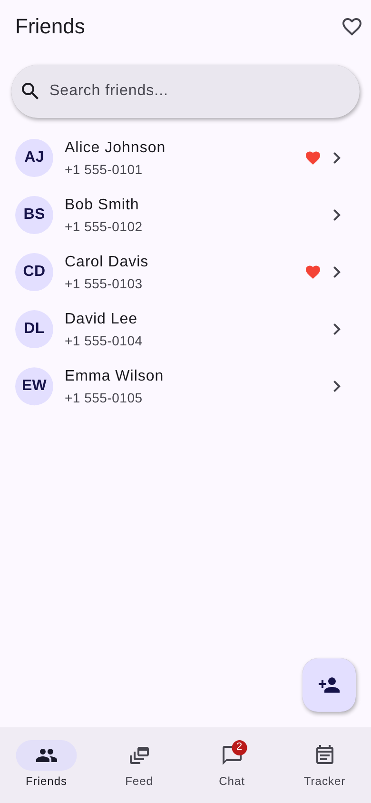
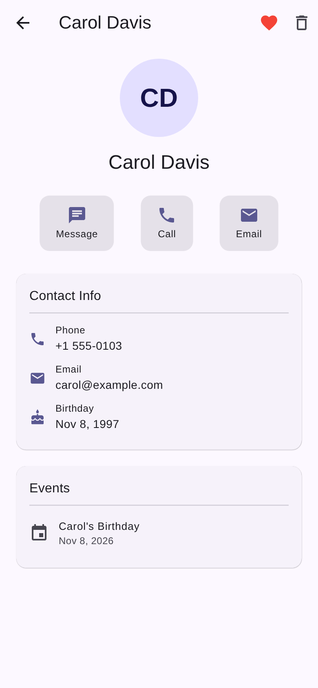
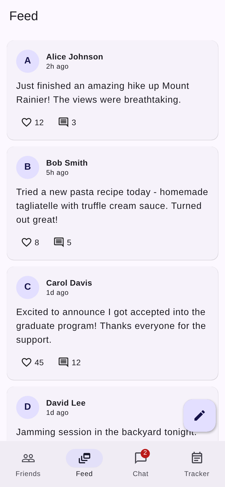
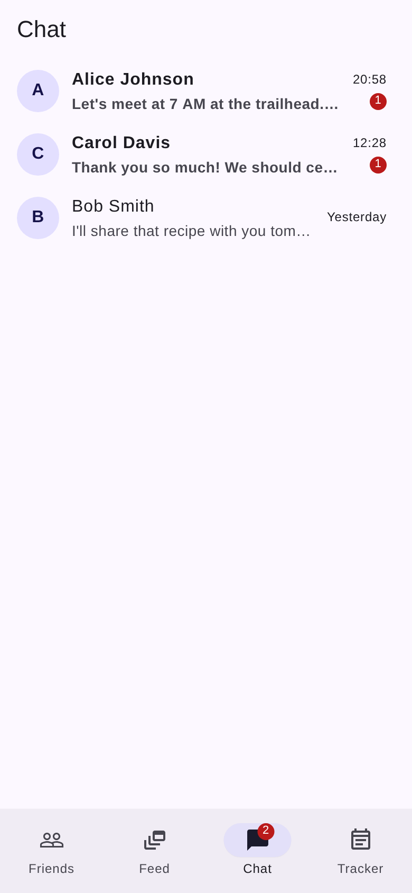
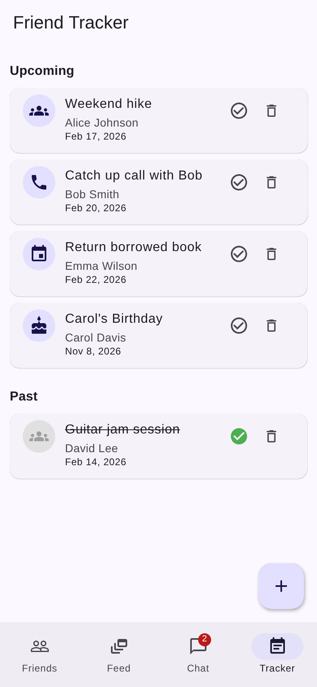

# CLAUDE.md

This repository contains two projects:

1. **CopilotKit + Google ADK Starter** — A full-stack AI agent web app (Next.js + Python)
2. **Friends App** — A cross-platform Flutter mobile app for managing friendships

---

## Repository Structure

```
with-adk/
├── CLAUDE.md
├── README.md
├── LICENSE                        # MIT
│
├── ── CopilotKit + ADK Project ──
├── package.json                   # Node.js deps & scripts
├── tsconfig.json                  # TypeScript config
├── next.config.ts                 # Next.js config
├── eslint.config.mjs              # ESLint flat config
├── postcss.config.mjs             # Tailwind CSS 4 PostCSS plugin
├── agent/
│   ├── agent.py                   # Python ADK agent (Gemini 2.5 Flash)
│   └── requirements.txt           # Python dependencies
├── scripts/
│   ├── setup-agent.sh/.bat        # Create venv & install Python deps
│   └── run-agent.sh/.bat          # Activate venv & start agent server
├── src/
│   └── app/
│       ├── layout.tsx             # Root layout with CopilotKit provider
│       ├── page.tsx               # Main UI: proverbs list, theme, chat sidebar
│       ├── globals.css            # Tailwind imports & CSS variables
│       └── api/copilotkit/
│           └── route.ts           # CopilotKit runtime API endpoint
├── public/                        # Static SVG assets (Next.js)
│
├── ── Friends Flutter App ────────
└── friends-app/
    ├── pubspec.yaml               # Flutter deps & config
    ├── analysis_options.yaml      # Dart lint rules
    ├── .gitignore                 # Flutter build artifact exclusions
    ├── android/
    │   └── app/src/main/
    │       └── AndroidManifest.xml
    ├── assets/images/             # Image assets (placeholder)
    └── lib/
        ├── main.dart              # App entry point, theme, providers
        ├── models/
        │   ├── friend.dart        # Friend data model
        │   ├── post.dart          # Social post model
        │   ├── message.dart       # Message & Conversation models
        │   └── event.dart         # FriendEvent model (tracker)
        ├── providers/
        │   ├── friends_provider.dart   # Friends CRUD & search
        │   ├── posts_provider.dart     # Feed post management
        │   ├── chat_provider.dart      # Conversations & messaging
        │   └── events_provider.dart    # Event tracking
        └── screens/
            ├── home_screen.dart            # Bottom nav with 4 tabs
            ├── friends_screen.dart         # Contact list with search
            ├── friend_detail_screen.dart   # Friend profile & actions
            ├── add_friend_screen.dart      # Add friend form
            ├── feed_screen.dart            # Social feed with posts
            ├── conversations_screen.dart   # Chat conversation list
            ├── chat_screen.dart            # Chat message bubbles UI
            └── tracker_screen.dart         # Events tracker
```

---

# Project 1: CopilotKit + Google ADK Starter

## Overview

A full-stack AI agent web application that manages a list of proverbs via an AI-powered chat sidebar. Built with Next.js on the frontend and a Python Google ADK agent on the backend, connected through CopilotKit.

## Architecture

```
Browser
  └─► Next.js 15 (port 3000)
        └─► /api/copilotkit (POST)
              └─► CopilotKit Runtime + HttpAgent (@ag-ui/client)
                    └─► Python FastAPI (port 8000)
                          └─► Google ADK Agent (Gemini 2.5 Flash)
```

- **Frontend** (`src/`): Next.js App Router, React 19, CopilotKit for AI chat UI, Tailwind CSS 4
- **Backend** (`agent/`): FastAPI server running a Google ADK agent wrapped with `ag-ui-adk` middleware
- **Communication**: Frontend → `/api/copilotkit` → CopilotKit Runtime → Python agent at `localhost:8000`
- **State sync**: Bidirectional via CopilotKit's `useCoAgent` hook

## Tech Stack

### Frontend
- **Next.js 15.3.2** — App Router, Turbopack dev server
- **React 19** — UI library
- **CopilotKit 1.10.4** — `@copilotkit/react-core`, `@copilotkit/react-ui`, `@copilotkit/runtime`
- **@ag-ui/client** — HTTP agent adapter for CopilotKit-to-ADK communication
- **Tailwind CSS 4** — via `@tailwindcss/postcss` PostCSS plugin
- **Zod** — schema validation for frontend actions
- **TypeScript 5** — type safety

### Backend (Python)
- **FastAPI** + **Uvicorn** — ASGI web server
- **google-adk** — Google Agent Development Kit
- **google-genai** — Google Generative AI (Gemini models)
- **ag-ui-adk** — AG-UI adapter for ADK agents
- **Pydantic** — state/data model validation
- **python-dotenv** — environment variable loading

## Key Files

| File | Purpose |
|------|---------|
| `src/app/page.tsx` | Main client component: proverbs list UI, `useCoAgent` shared state, `useCopilotAction` for `setThemeColor` and `get_weather` generative UI (`WeatherCard`), `CopilotSidebar` chat interface |
| `src/app/layout.tsx` | Root layout wrapping app in `<CopilotKit>` provider, connects to agent `"my_agent"`, loads CopilotKit CSS |
| `src/app/api/copilotkit/route.ts` | POST endpoint: creates `CopilotRuntime` with `HttpAgent` pointing to `localhost:8000`, uses `ExperimentalEmptyAdapter` for single-agent mode |
| `agent/agent.py` | `ProverbsAgent` (Gemini 2.5 Flash) with `set_proverbs` and `get_weather` tools, callbacks for state init and system prompt injection, FastAPI server on port 8000 |

## Development Commands

```bash
# Install all dependencies (Node + Python agent venv)
npm install                  # Triggers postinstall → npm run install:agent

# Start both frontend and agent concurrently
npm run dev                  # UI on :3000, Agent on :8000

# Start individually
npm run dev:ui               # Next.js dev server with Turbopack
npm run dev:agent            # Python agent server

# Debug mode
npm run dev:debug            # LOG_LEVEL=debug

# Production
npm run build                # Next.js production build
npm run start                # Start production server

# Linting
npm run lint                 # ESLint: next/core-web-vitals + next/typescript
```

## Environment Variables

| Variable | Required | Description |
|----------|----------|-------------|
| `GOOGLE_API_KEY` | Yes | Google Makersuite API key for Gemini model access. Get one at https://makersuite.google.com/app/apikey |
| `PORT` | No | Agent server port (default: `8000`) |
| `LOG_LEVEL` | No | Set to `debug` for verbose logging |

## Agent Architecture

The Python agent (`agent/agent.py`) components:

- **`ProverbsState`** (Pydantic): Shared state with `proverbs: list[str]`
- **Tools**:
  - `set_proverbs(new_proverbs)` — replaces the full proverbs list in `ToolContext.state`
  - `get_weather(location)` — returns mock weather data
- **Callbacks**:
  - `on_before_agent` — initializes empty proverbs state if missing
  - `before_model_modifier` — injects current proverbs JSON into system prompt before each LLM call
  - `simple_after_model_modifier` — ends invocation after text response (prevents tool-calling loops)
- **Middleware**: `ADKAgent` wrapper with `InMemorySessionService` (3600s timeout), app name `"proverbs_app"`

## Frontend Patterns

- **Client components**: `"use client"` directive in `page.tsx`
- **Shared state**: `useCoAgent<AgentState>({ name: "my_agent" })` — syncs bidirectionally with agent
- **Frontend actions**: `useCopilotAction()` with name, description, Zod parameters, handler
- **Generative UI**: `useCopilotAction` with `render` prop for inline chat components (e.g. `WeatherCard`)
- **Path alias**: `@/*` → `./src/*` (tsconfig.json)

## ADK Project Conventions

- **Lock files are gitignored** — avoids conflicts between npm/yarn/pnpm/bun
- **Python venv** at `agent/.venv/` (gitignored)
- **No test framework** configured
- **ESLint** flat config extending `next/core-web-vitals` and `next/typescript`
- **Tailwind CSS 4** via PostCSS plugin (no `tailwind.config.js`)
- **Cross-platform scripts** — `.sh` (Linux/Mac) and `.bat` (Windows) variants

## Common Tasks (ADK Project)

**Adding a new agent tool**: Define a Python function in `agent/agent.py` accepting `tool_context: ToolContext` as the first parameter, add it to `tools` list in the `LlmAgent` constructor.

**Adding a frontend action**: Use `useCopilotAction()` in `page.tsx` with name, description, parameters (Zod), and handler.

**Modifying shared state**: Update `ProverbsState` in `agent/agent.py` and `AgentState` type in `page.tsx`.

**Changing the AI model**: Update `model` in the `LlmAgent` constructor in `agent/agent.py`.

---

# Project 2: Friends App (Flutter)

## Overview

A cross-platform mobile application for managing friendships, built with Flutter. The app provides four core features: contact management, a social feed, real-time chat, and friend interaction tracking. It runs on Android, iOS, web, and desktop platforms.

## Tech Stack

- **Flutter 3** (Dart SDK >=3.0.0)
- **Material 3** — Google's latest Material Design system
- **Provider 6** — state management via `ChangeNotifier`
- **intl** — date formatting (`DateFormat.yMMMd()`)
- **image_picker** — photo capture/selection (for future use)
- **shared_preferences** — local key-value storage (for future use)
- **uuid** — unique ID generation (for future use)

## App Architecture

```
main.dart (entry point)
  └─► MultiProvider (4 providers)
        └─► MaterialApp (Material 3, light/dark theme)
              └─► HomeScreen (IndexedStack + NavigationBar)
                    ├── Tab 1: FriendsScreen    → FriendDetailScreen / AddFriendScreen
                    ├── Tab 2: FeedScreen       → CreatePost bottom sheet
                    ├── Tab 3: ConversationsScreen → ChatScreen
                    └── Tab 4: TrackerScreen    → AddEvent bottom sheet
```

### State Management Pattern

Uses **Provider** with `ChangeNotifier` for reactive state. Four independent providers manage their own domain:

```
FriendsProvider   → List<Friend>         (CRUD, search, favorites)
PostsProvider     → List<Post>           (create, like/unlike, delete)
ChatProvider      → Map<id, Conversation> (send, mark read, unread counts)
EventsProvider    → List<FriendEvent>    (CRUD, toggle complete, upcoming/past)
```

All providers are registered in `main.dart` via `MultiProvider` and consumed in screens using `context.watch<T>()` (reactive) or `context.read<T>()` (one-shot).

## Data Models

### `Friend` (`lib/models/friend.dart`)
| Field | Type | Description |
|-------|------|-------------|
| `id` | `String` | Unique identifier |
| `name` | `String` | Full name |
| `phone` | `String` | Phone number |
| `email` | `String` | Email address |
| `avatarUrl` | `String?` | Profile image URL |
| `birthday` | `DateTime?` | Date of birth |
| `notes` | `String?` | Personal notes |
| `lastInteraction` | `DateTime` | Last interaction timestamp |
| `isFavorite` | `bool` | Whether marked as favorite |

Computed: `initials` — returns first letter of first and last name (e.g. "AJ" for Alice Johnson).

### `Post` (`lib/models/post.dart`)
| Field | Type | Description |
|-------|------|-------------|
| `id` | `String` | Unique identifier |
| `authorId` | `String` | Author's friend ID or "me" |
| `authorName` | `String` | Display name |
| `content` | `String` | Post text content |
| `imageUrl` | `String?` | Optional image |
| `createdAt` | `DateTime` | Post timestamp |
| `likes` / `comments` | `int` | Engagement counts |
| `isLikedByMe` | `bool` | Current user like state |

### `Message` + `Conversation` (`lib/models/message.dart`)
**Message**: `id`, `senderId`, `receiverId`, `content`, `timestamp`, `isRead`

**Conversation**: Groups messages by friend. Computed: `lastMessage`, `unreadCount` (messages from friend that are unread).

### `FriendEvent` (`lib/models/event.dart`)
| Field | Type | Description |
|-------|------|-------------|
| `id` | `String` | Unique identifier |
| `friendId` / `friendName` | `String` | Associated friend |
| `type` | `EventType` | `meetup`, `birthday`, `call`, `message`, `custom` |
| `title` / `description` | `String` | Event details |
| `date` | `DateTime` | Scheduled date |
| `isCompleted` | `bool` | Completion status |

All models have `copyWith()` methods for immutable updates.

## Screens & UI Screenshots

Screenshots are located in `friends-app/docs/screenshots/`.

### Tab 1: Friends (Contact List) — `friends_screen.dart`



- **Search bar** with real-time filtering by name, email, or phone
- **Favorites filter** toggle (heart icon in app bar)
- **Friend tiles** showing purple avatar (initials), name, phone, favorite heart indicator
- **Tap** → navigates to `FriendDetailScreen`
- **Long press** → toggles favorite status
- **FAB** (bottom right) → navigates to `AddFriendScreen`
- **Bottom navigation** with 4 tabs; Chat tab shows unread badge count

### Friend Detail — `friend_detail_screen.dart`



- **Large circular avatar** with initials (e.g. "CD" for Carol Davis)
- **Quick action chips**: Message (opens chat), Call, Email
- **Contact Info card**: phone number, email address, birthday with date formatting
- **Notes card**: personal notes about the friend
- **Events card**: all tracked events for this friend with dates
- **App bar actions**: red heart toggle for favorite, trash icon for delete (with confirmation dialog)

### Add Friend — `add_friend_screen.dart`
- **Form** with validation (name required)
- **Fields**: Name, Phone, Email, Birthday (date picker), Notes
- **Save** button in app bar

### Tab 2: Social Feed — `feed_screen.dart`



- **Post cards** with author avatar circle, bold name, relative timestamp ("2h ago", "1d ago")
- **Post content** displayed as body text
- **Like button** (heart icon) with count — toggleable, turns red when liked
- **Comment count** with comment icon
- **Delete** button on own posts (trash icon)
- **FAB** (pencil icon) → bottom sheet to compose new post
- Cards are elevated with rounded corners (Material 3 style)

### Tab 3: Chat — `conversations_screen.dart`



- **Conversation list** sorted by most recent message
- **Each row**: purple avatar with initial, bold name (if unread), message preview (truncated), timestamp
- **Unread badges**: red circular badges with count (e.g. "1") on conversations with unread messages
- **"You:" prefix** on sent message previews
- **Timestamps**: time format for today, "Yesterday" for previous day
- **Tap** → opens `ChatScreen` with full message history

### Chat Messages — `chat_screen.dart`
- **Message bubbles**: sent messages (right-aligned, purple background) vs received (left-aligned, grey)
- **Timestamps** on each bubble (HH:MM format)
- **Rounded bubble corners** with different radius for sent vs received
- **Auto-scroll** to bottom on new messages
- **Text input** bar with rounded field and filled send button
- **Auto mark-as-read** when chat is opened

### Tab 4: Friend Tracker — `tracker_screen.dart`



- **Upcoming** section header, events sorted by date
- **Event cards** with type-specific icons: groups (meetup), phone (call), calendar (custom), cake (birthday)
- **Each card shows**: event title, friend name, formatted date (e.g. "Feb 17, 2026")
- **Action buttons**: circle checkmark (toggle complete), trash (delete)
- **Past** section: completed events shown with strikethrough title text and green checkmark
- **FAB** (+) → bottom sheet form with: friend dropdown, title, description, event type selector, date picker

## Theme & Styling

- **Color scheme**: Purple/indigo seed color (`#6C63FF`) with `ColorScheme.fromSeed()`
- **Material 3**: `useMaterial3: true` — rounded corners, elevated cards, filled buttons
- **Light & dark mode**: both defined, follows system preference (`ThemeMode.system`)
- **Font**: Roboto
- **Components used**: `NavigationBar`, `SearchBar`, `Card`, `ListTile`, `Badge`, `CircleAvatar`, `FilledButton`, `OutlinedButton`, `FloatingActionButton`, `ModalBottomSheet`

## Sample Data

The app ships with pre-loaded sample data for immediate demonstration:

- **5 friends**: Alice Johnson, Bob Smith, Carol Davis, David Lee, Emma Wilson
- **5 posts**: hiking, cooking, graduation, music, sunset content
- **3 conversations**: Alice (3 messages), Carol (2 messages), Bob (1 message)
- **5 events**: Weekend hike, Carol's birthday, catch up call, guitar jam (completed), return book

## Running the Friends App

### Prerequisites
- Flutter SDK 3.0+ installed (https://docs.flutter.dev/get-started/install)
- For Android: Android Studio + emulator or USB-connected device
- For web: Chrome browser

### Commands
```bash
cd friends-app

# Install dependencies
flutter pub get

# Run on different platforms
flutter run -d chrome       # Web (browser)
flutter run -d android      # Android device/emulator
flutter run -d ios          # iOS simulator (macOS only)
flutter run -d macos        # macOS desktop
flutter run -d windows      # Windows desktop

# Build release APK
flutter build apk

# Build release web
flutter build web
```

## Common Tasks (Friends App)

**Adding a new friend field**: Add the field to `Friend` model in `lib/models/friend.dart` (include in constructor + `copyWith`), update `AddFriendScreen` form, and update `FriendDetailScreen` display.

**Adding a new screen/feature**: Create a new screen in `lib/screens/`, add a provider in `lib/providers/` if needed, register it in `MultiProvider` in `main.dart`.

**Adding a new event type**: Add value to `EventType` enum in `lib/models/event.dart`, update `typeLabel` getter, and add icon mapping in `_EventCard._iconForType()` in `tracker_screen.dart`.

**Changing the color scheme**: Update the `seedColor` in `ColorScheme.fromSeed()` in `lib/main.dart`.

**Adding persistent storage**: The `shared_preferences` dependency is already included. Use it in providers to save/load state across app restarts.

---

## General Conventions

- **All models** use immutable fields with `copyWith()` for updates
- **State management** is provider-based (`ChangeNotifier` + `Provider`)
- **No backend** for the Friends app — all data is in-memory (providers), ready for API/database integration
- **Lock files gitignored** across both projects
- **Cross-platform** — ADK project has `.sh`/`.bat` scripts; Friends app runs on Android, iOS, web, desktop
